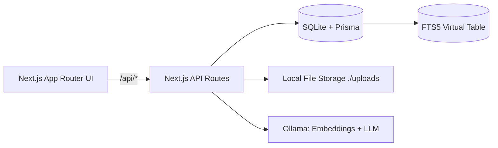
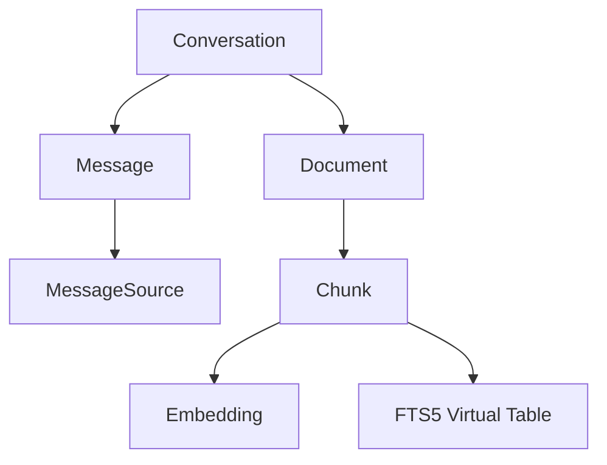

# 🧠 Second Brain — Local-First RAG App

A private, zero-cost, local-first "second brain" to search your PDFs with AI.
Runs on your machine with **Next.js + SQLite (Prisma) + Ollama**. No cloud, no API fees.

## Why this exists
We drown in notes and PDFs. Traditional search misses nuance. This app uses **hybrid retrieval** (FTS5 BM25 + semantic vectors) and a local LLM to answer questions with **citations**—fast, private, and free.

## Highlights
- **Local-first & private** – files and vectors never leave your machine
- **Hybrid search** – SQLite **FTS5** prefilter ➜ cosine similarity over embeddings
- **Streaming answers** – real-time output with a **Stop** button
- **Multi-chat** – each chat has its **own context & files**
- **Zero setup DB** – SQLite with Prisma (checked into repo)

## Architecture (high level)




## Quick Start

### 0) Requirements
- **Node.js 20+**
- **Ollama** (Windows/Linux) with models: `all-minilm` (embeddings), `llama3` (LLM)

### 1) Clone & install
```bash
git clone <your-repo-url> second-brain
cd second-brain
npm install
```

### 2) Set environment
Create `.env.local` (see all options below):
```bash
DATABASE_URL=file:./data/app.db
UPLOAD_DIR=./uploads
OLLAMA_BASE=http://localhost:11434
OLLAMA_EMBED_MODEL=all-minilm
OLLAMA_LLM_MODEL=llama3
TOP_K=5
MAX_CONTEXT_CHARS=3000
PREFILTER_LIMIT=200
```

### 3) Start Ollama & pull models

**Windows (PowerShell)**
```powershell
ollama serve
ollama pull all-minilm
ollama pull llama3
```

**Linux**
```bash
ollama serve
ollama pull all-minilm
ollama pull llama3
```

### 4) Migrate DB & run
```bash
npx prisma migrate dev
npx prisma generate
npm run dev
```

Open `http://localhost:3000`

### 5) Use it
1. **New Chat** ➜ you're in Draft (no DB row yet)
2. Click **+** to add PDFs (up to 10) ➜ auto-embedded
3. **Ask a question** ➜ streaming answer + citations
4. **Switch chats** via left sidebar; **Delete** cascades files + vectors

## Environment variables

Copy `.env.example` ➜ `.env.local` and adjust as needed.

```bash
# Database & storage
DATABASE_URL=file:./data/app.db        # SQLite file path
UPLOAD_DIR=./uploads                   # Where PDFs are stored

# Ollama
OLLAMA_BASE=http://localhost:11434
OLLAMA_EMBED_MODEL=all-minilm          # e.g., nomic-embed-text, mxbai-embed-large
OLLAMA_LLM_MODEL=llama3                # e.g., mistral, phi, gemma

# Retrieval knobs
TOP_K=5                                # chunks passed to LLM
MAX_CONTEXT_CHARS=3000                 # max context size
PREFILTER_LIMIT=200                    # FTS5 candidates before cosine
```

## Testing (manual)

- **Multi-chat nav**: Draft ➜ ask ➜ chat created. New Chat ➜ draft ➜ upload ➜ ask. Switch back ➜ history intact.
- **Delete cascade**: Delete a chat ➜ files removed from `./uploads`, rows removed from Document/Chunk/Embedding.
- **Errors**: Stop Ollama ➜ ask ➜ friendly "Ollama not running" message. Wrong model ➜ hint to `ollama pull`.
- **FTS5 fallback**: Ask something not in docs ➜ graceful "not found in notes".
- **Long PDF**: Upload a large PDF ➜ chunk/embedding completes; query latency OK.

## Performance tips

- Start with `TOP_K=5`, `MAX_CONTEXT_CHARS=2500–3000`, `PREFILTER_LIMIT=200`
- If answers seem off-topic, raise `TOP_K` slightly
- If slow before LLM, lower `PREFILTER_LIMIT`


## Roadmap (post-V1)

- OCR for scanned PDFs
- Conversation rename/pin
- Export chat as Markdown with sources
- Optional cloud deploy (Vercel + Postgres + blob)